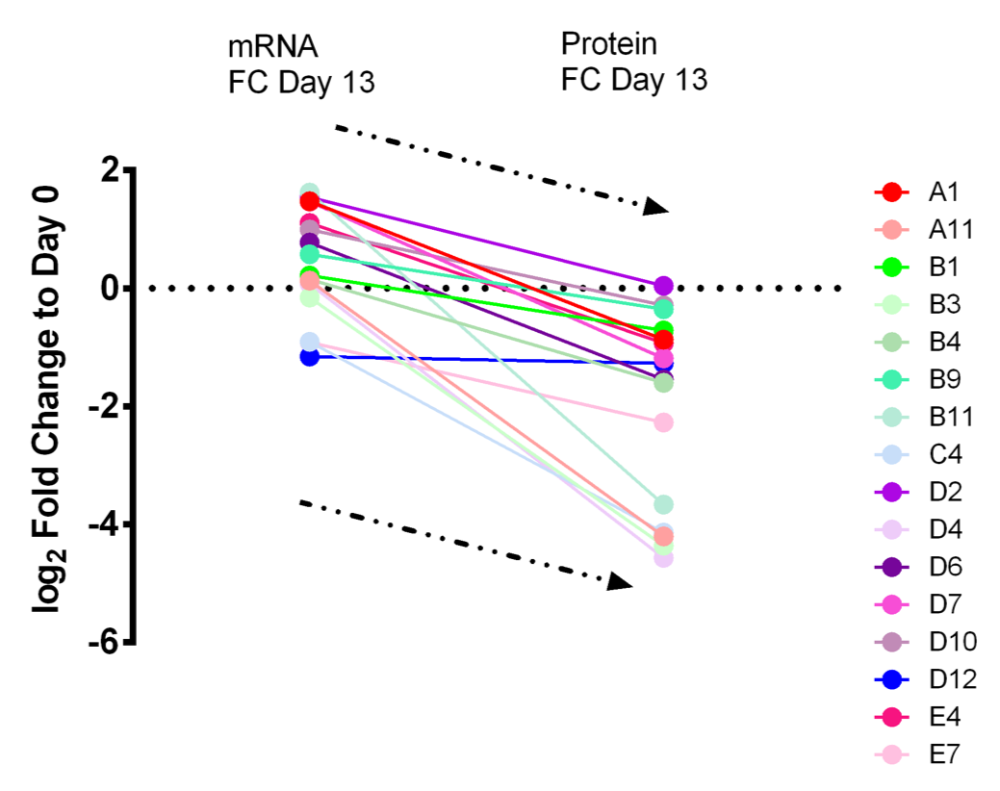
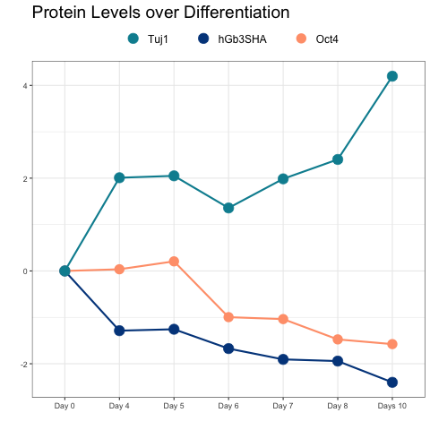
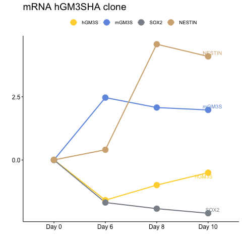
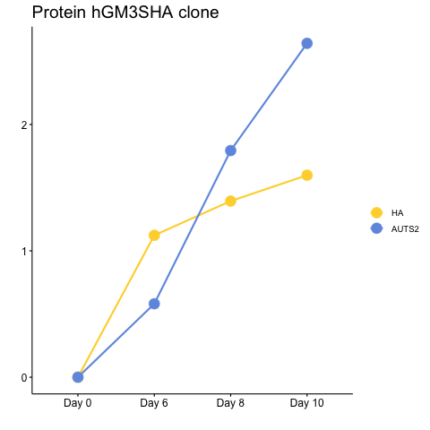
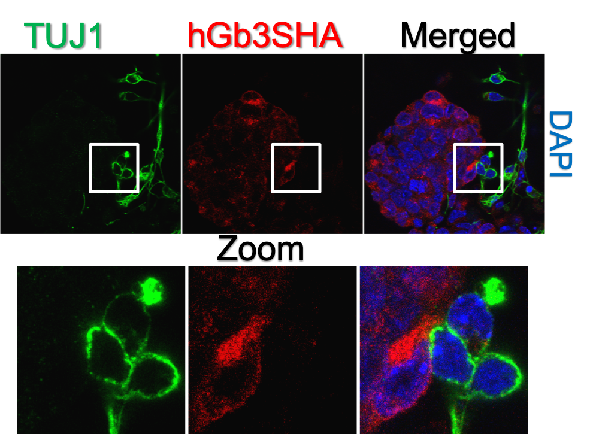
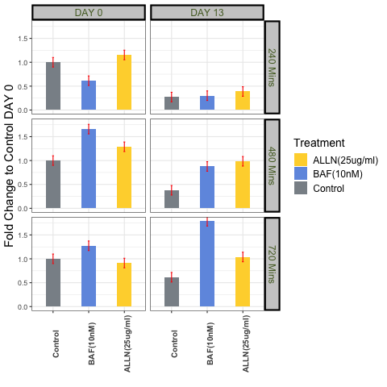
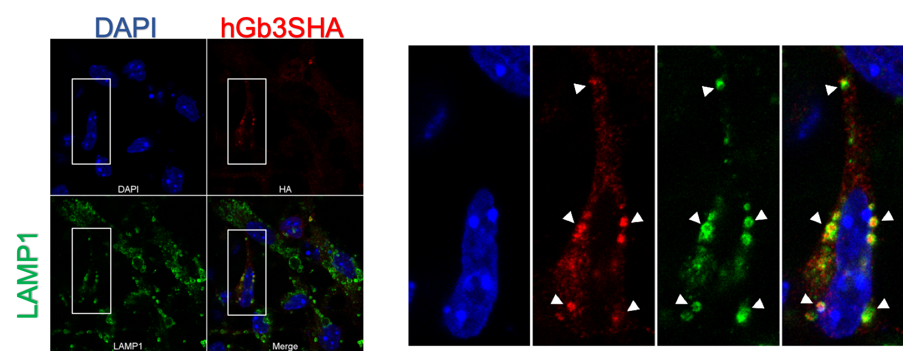
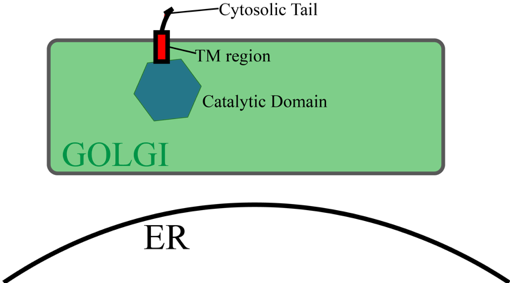
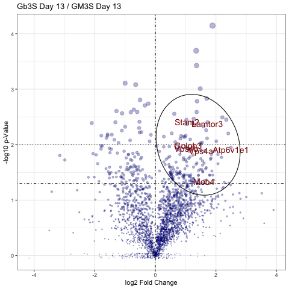

class: center middle

background-image: url("/Users/loomba/Desktop/lab meetings and seminars/knownmodel.png")
background-size: contain

#Background

--
*Globo*-to-*Ganglio* switch over neuronal differentiation.
<br>
<br>
--
**Gb3** inhibits *GM3S* via *AUTS2*

---
class: 

.pull-left[###*hGb3SHA* protein is lost over differentiation.

```{r, fig.retina=5, echo=FALSE}

```

```{r, fig.retina=2, echo=FALSE}

```
]
--
.pull-right[###*hGM3SHA* protein increases over differentiation.

```{r, fig.retina=2.25, echo=FALSE}


```
]

---

class:

.pull-left[###*hGb3SHA* is actively degraded in lysosomes upon neuronal differentiation.
]
--
.pull-right[]
--
.center[
```{r, echo=FALSE, fig.retina=3.25}

```

]

---
class: left

background-image: url("/Users/loomba/Desktop/lab meetings and seminars/Working model.png")
background-size: contain

# Working Model

--
.left-column[
- Gb3S and GM3S are regulated post-tranlationally.]

--
.left-column[- The drop in Gb3S precedes the drop in stem cell markers.]

---
class: center middle

--
.pull-left[##Direct protein-protein interaction mediated regulation.
- FAIM2
- GRINA
- LAPTM4A
- TM9SF2
- GOLPH3]

--
.pull.right[##Post Translational Modification.
- Palmitoylation
- Ubiquitination
- Other]

---
class: center middle 

##Bait-Fishing experiment with cytosolic tails.

.pull-left[

```{r, echo=FALSE, eval=TRUE, fig.retina=3}

```
]

--
.pull-right[
$$FC =  \frac {TSN Gb3S(\frac {Day13}{Day0})}{{TSN GM3S(\frac {Day13}{Day0})}} $$
]

---
class: center middle

#Planned Experiments

- Recently developed 2 new stable E14 ES cell lines overexpressing *human* Gb3S and GM3S TM + cytosolic domains fused with GFP. Validation ongoing.

- Differentiating the HA cell line to cardiomyocyte fate and observe if the phenotype is conserved. 

- Overexpressing the candidate proteins in an inducible system in the stable cell lines and observe if Gb3SHA is relocalized to the lysosomes in stem cell stage.


